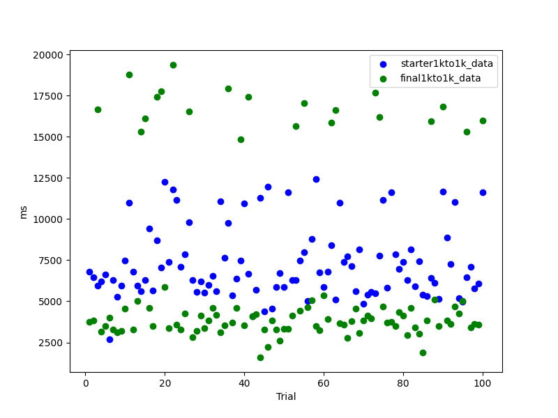

# Synoptic Infrastructure Bounty

This repository contains the infrastructure for the Synoptic Bounty. The infrastructure is divided into three main components: server, publisher, and client. The server listens for messages from the publisher and sends them to the client. The publisher generates random messages and sends them to the server, while the client listens for messages from the server.

Two example implementations are provided: one using gRPC and another using sockets. The gRPC implementation is located in the `grpc` directory, while the socket implementation is located in the `sockets` directory.

Please read more about each setup in the corresponding README files.